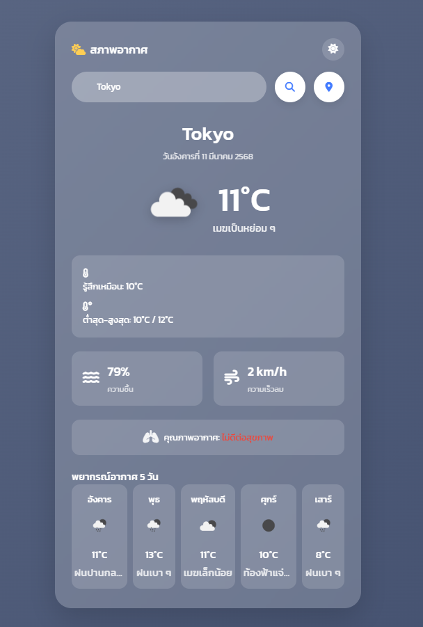

# 🌤 Weather App

Weather App เป็นแอปพลิเคชันสำหรับตรวจสอบสภาพอากาศและพยากรณ์อากาศล่วงหน้า 5 วัน รองรับการค้นหาชื่อเมืองและการใช้ตำแหน่งปัจจุบัน พร้อมโหมดสีเข้ม/สีอ่อนเพื่อประสบการณ์การใช้งานที่ดียิ่งขึ้น

[🔗 ทดลองใช้งาน Weather App](https://mindenry.github.io/WeatherWeb/)

## 🚀 คุณสมบัติเด่น
- 🔍 **ค้นหาสภาพอากาศ** ได้โดยพิมพ์ชื่อเมืองที่ต้องการ
- 📍 **ใช้ตำแหน่งปัจจุบัน** เพื่อดูพยากรณ์อากาศได้ทันที
- 🌡 **แสดงรายละเอียด** เช่น อุณหภูมิ ความชื้น ความเร็วลม และดัชนีคุณภาพอากาศ (AQI)
- 📅 **พยากรณ์อากาศ 5 วัน** พร้อมไอคอนแสดงสภาพอากาศ
- 🌙 **โหมดสีเข้ม/สีอ่อน** ปรับแต่งตามความสะดวก

## 📦 เทคโนโลยีที่ใช้
- HTML, CSS, JavaScript (Vanilla JS)
- OpenWeather API สำหรับดึงข้อมูลสภาพอากาศ
- FontAwesome สำหรับไอคอน
- Google Fonts (Kanit) เพื่อความสวยงามของตัวอักษร

## 🛠 วิธีติดตั้งและใช้งาน
1. **ดาวน์โหลดโค้ด** หรือโคลนโปรเจกต์นี้จาก GitHub
2. เปิดไฟล์ `index.html` ด้วยเว็บเบราว์เซอร์
3. สนุกกับการตรวจสอบสภาพอากาศได้เลย! 🌍🌤

## 📸 ภาพตัวอย่าง

## 💡 การปรับปรุงในอนาคต
- เพิ่มการแสดงพยากรณ์รายชั่วโมง
- รองรับหลายภาษา
- ปรับปรุง UI ให้สวยงามและใช้งานง่ายขึ้น

## 📝 เครดิต
- ข้อมูลสภาพอากาศจาก [OpenWeather](https://openweathermap.org/)
- ไอคอนจาก [FontAwesome](https://fontawesome.com/)
- ฟอนต์โดย [Google Fonts](https://fonts.google.com/)

✨ *ขอบคุณที่ใช้งาน Weather App! ขอให้มีวันที่สดใส ☀️*

